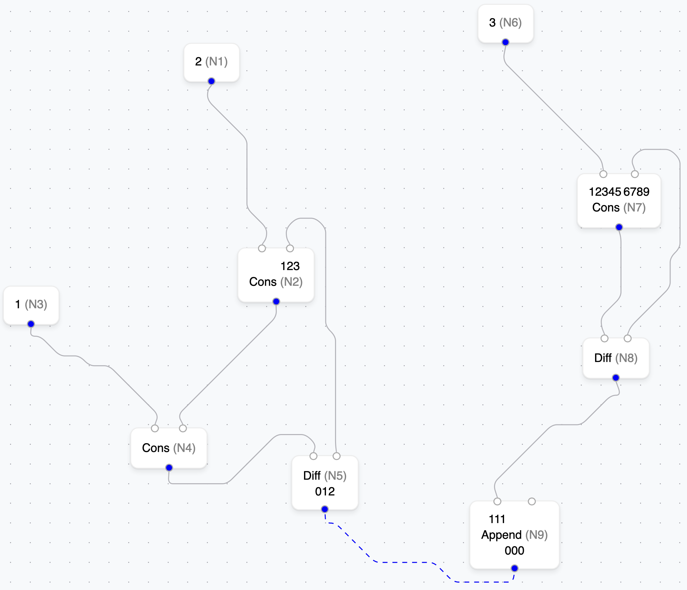
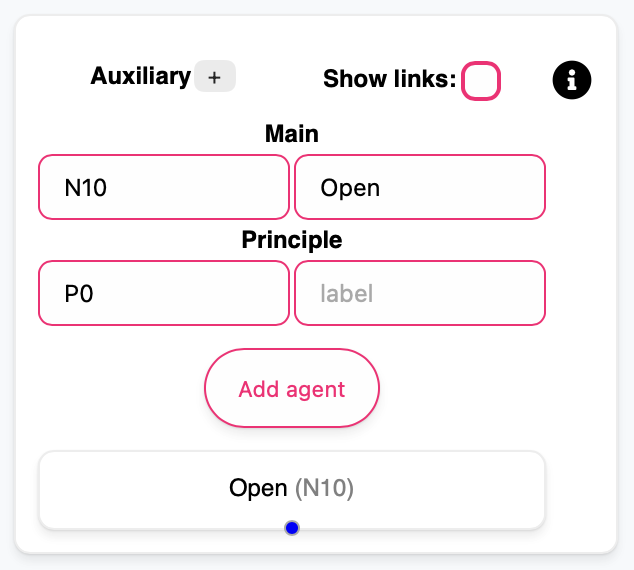
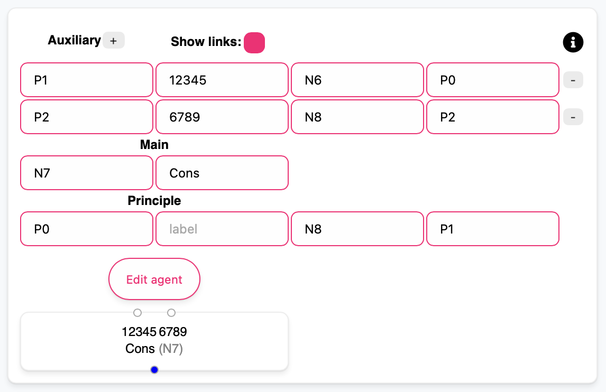

# INflow

**INflow** — an interactive web application for visualizations of interaction nets using [React Flow](https://reactflow.dev).

## Install

```shell
npm install
```

## Usage

When you launch the app, ["Adding to the list"](./saved-nets/list_add_1.json) net is displayed.

```shell
npm run dev
```

### Run tests

```shell
npx cypress run  
```

## Drawing



> See more on [demos](<./demos>).

## Help Documentation

### Menu Configuration

#### Port Management

* Auxiliary (`+` Button): add input fields to configure source auxiliary ports
* Show Links (Toggle): display/hide fields for target port connections

#### Agent Properties

* id - agent identifier (**required**, must be unique)
* label - agent name (**required**)

#### Port Properties

* id - port identifier (**required**, must be unique)
* label - port info

#### Visual Preview

The bottom section displays a real-time preview of the agent being configured.

| Basic Configuration | Configuration with Links |
|-|--|
|||

A blue port handle circle signifies the principle port. A animated blue edge indicates the active pair.

> `Add/Edit agent` button becomes enabled when all required fields are properly filled.

> To create edges during agent creation, you must specify the target agent id and port id.

### Basic Interactions

#### Selection & Manipulation

* Click any agent or edge to select it
* Press Backspace/Delete to remove selected elements
* Drag agents to reposition them
* Drag from ports to create connections between agents
* Select any agent to edit it or its edges

#### Connection Creation

1. Hover over any port (indicated by handle circles)
2. Click and drag to another port
3. Release to establish connection

#### Load

Format: JSON files containing a representation of the net

* Upload: a directory or multiple files
* Download: the displayed net

### Supported Layouts

* [Dagre](https://reactflow.dev/examples/layout/dagre)
  * Horizontal
  * Vertical
* ELKjs
  * [Basic](https://reactflow.dev/examples/layout/elkjs)
    * Horizontal
    * Vertical
  * [Multiple Handles](https://reactflow.dev/examples/layout/elkjs-multiple-handles)
* [D3-Hierarchy](https://reactflow.dev/learn/layouting/layouting#d3-hierarchy)
* [D3-Force](https://reactflow.dev/learn/layouting/layouting#d3-force)

> See layouting comparison [here](https://reactflow.dev/learn/layouting/layouting#layouting-nodes).

### Navigation & Controls

#### Zoom Operations

* Zoom In/Out: button controls for precise zoom adjustment
* Fit to View: auto-adjust to display entire net

#### Net Switching

Net switching becomes available after uploading two or more net files.
The net elements are marked in green and orange when they appear and disappear respectively.

* Next net (`→`): advance to subsequent net in loaded sequence
* Previous net (`←`): return to previous net in loaded sequence

### Keyboard Shortcuts

#### Multi-Selection

* Ctrl/Cmd + Click: select multiple agents/edges
* Shift + Drag: rectangular area selection

#### Navigation & Actions

* Zoom: mouse wheel or pinch gesture
* Pan: hold space + drag or middle mouse drag
* Delete: select element + Backspace/Delete key

> See more on [the reference](<https://reactflow.dev/api-reference/react-flow#keyboard-props>).
