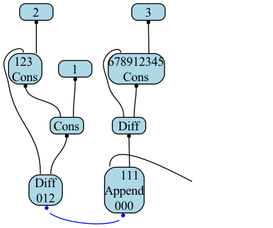

# INviz

**INviz** — a script/utility for visualizations of interaction nets using [Graphviz](https://graphviz.org).
The utility creates a PNG file from a network in JSON-format using DOT.

## Usage

```shell
python3 main.py ../example-nets/list_add/list_add_1.json
```

```shell
python3 main.py ../example-nets/list_add
```

### Run tests

```shell
python3 -m pytest . -vv
```

## Drawing



## Help

You can view the DOT file [here](./nets-dot/list_add_1.dot), which was created during the program execution.

> You can enable file creation by changing the `need_save_dot` argument in [main.py](./main.py).
