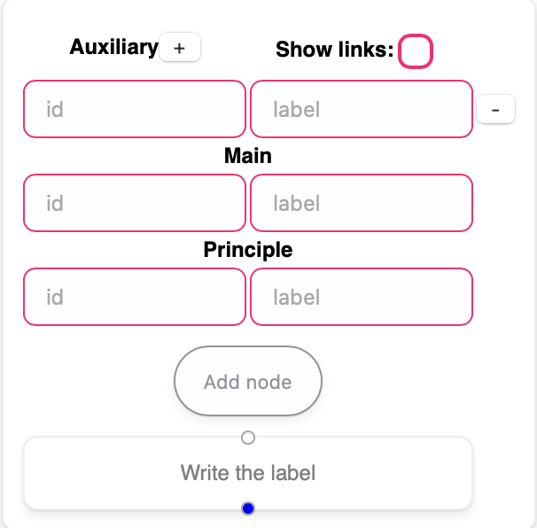
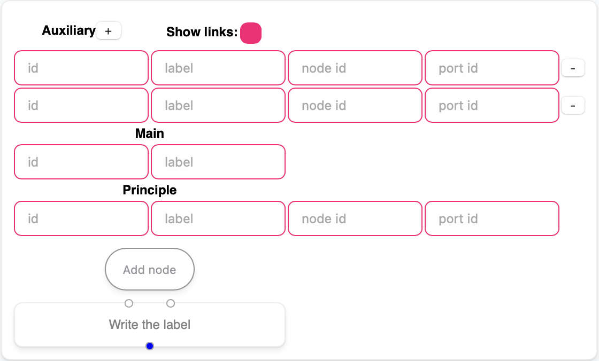

# react-flow

**react-flow** — a app for visualizations of interaction nets using *React Flow*.
When you launch the app, ["Adding to the list"](./saved-nets/app_list.json) network is displayed. You can download a different network from the bottom left menu.

## Installation

```shell
npm install
```

## Usage

```shell
npm run dev
```

## Help

### Menu Config

* *Auxiliary with plus button* - add fields for write options of source auxiliary ports;
* *Show links with toggle button* - show fields for write options of target ports;

* *Main* - options of creating node;
  * *id* - node id [required];
  * *label* - node label [required];

* *Principle* - options of the principle port;
  * *id* - port id [required];
  * *label* - port label.

In the bottom of the menu showed prewiev creaing node.

| MenuConfig | MenuConfig with links |
|-|--|
|||

> *The "Add node" button* is activated if all required options are specified.

> To create a node with edges, must enter the *node id* and *port id* of the target node.

### Base

Click on a node or edge to select it. The selected node or edge can be deleted using the *backspace* button. A node can be moved by hovering and dragging. An edge can be created by hovering over a port and dragging to another port.

> Click = left click

### Shortcuts

* ctrl/cmd + lc on node: select several nodes or edges;
* shift + dragging lc: select several nodes or edges in rectangular area.
